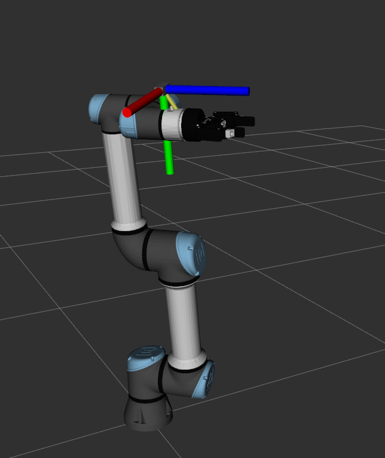

# 🤖 robot_gdl_description

Este paquete contiene la **descripción URDF/Xacro del manipulador UR5e** equipado con el **gripper Robotiq 2F-85** y una **cámara Intel RealSense** montada en el efector final.  
Su objetivo es proporcionar una representación completa y modular del robot para ser utilizada en simulación, visualización y planificación con ROS 2 Humble.

---

## 📦 Contenido del paquete

**Estructura general:**
```
robot_gdl_description/
├── launch/
│   └── view_robot.launch.py       # Launch principal para visualización
├── urdf/
│   ├── robot_gdl_macro.xacro      # Macro principal (UR + gripper + cámara)
│   └── robot_gdl.urdf.xacro       # Archivo que instancia la macro
├── config/
│   └── robot_description.png      # Imagen de referencia del modelo
├── rviz/
│   └── display.rviz               # Configuración predefinida de RViz
└── README.md                      # Este archivo
```

---

## ⚙️ Descripción del robot

El modelo representa un **brazo UR5e** de Universal Robots montado en el mundo (`world` frame), con:

- 🔩 **Gripper Robotiq 2F-85**, incluido mediante el paquete [`robotiq_description`](https://index.ros.org/p/robotiq_description/), conectado directamente al `tool0`.
- 🎥 **Cámara RealSense**, montada de forma fija en la parte frontal del gripper, orientada hacia el eje X positivo del efector final.
- 🧭 Frames correctamente definidos para integración con `robot_state_publisher`, `tf2` y `rviz2`.

---

## 🚀 Visualización en RViz

Para visualizar el robot ejecuta:

```bash
ros2 launch robot_gdl_description view_robot.launch.py
```

Este launch inicia:
- `joint_state_publisher_gui` → control manual de las articulaciones  
- `robot_state_publisher` → publicación de TFs  
- `rviz2` → visualización del modelo URDF  

---

## 🖼️ Vista del modelo



---

## 🧩 Dependencias requeridas

Asegúrate de tener instalados los siguientes paquetes:

```bash
sudo apt install   ros-humble-ur-description   ros-humble-robotiq-description   ros-humble-joint-state-publisher-gui   ros-humble-robot-state-publisher   ros-humble-rviz2
```

---

## 🛠️ Construcción del paquete

Desde tu workspace:

```bash
colcon build --packages-select robot_gdl_description --symlink-install
source install/setup.bash
```

---

## 📚 Notas adicionales

- El archivo `robot_gdl_macro.xacro` define la macro `robot_gdl` que combina el UR5e, el gripper Robotiq y la cámara.  
- Puedes personalizar la posición de la cámara modificando el `origin` del `joint` `robotiq_to_realsense`.  
- Para integrarlo con MoveIt o Gazebo, exporta el `robot_description` generado y reutilízalo en tus launchs de planificación o simulación.

---

**Autor:** Salvador López-Barajas  
**Centro:** CIRTESU – Universitat Jaume I (Castellón, España)  
**Versión:** ROS 2 Humble • 2025
